# Factory Method e Abstract Factory

Projeto desenvolvido em **Java Swing** para implementação dos padrões de projeto **Factory Method** e **Abstract Factory**, conforme a atividade proposta.

O projeto demonstra a criação de veículos por meio de fábricas, evitando que o código cliente dependa diretamente das classes concretas.

---

## Objetivo

Implementar, em Java, dois padrões de projeto criacionais:

- **Factory Method**
- **Abstract Factory**

Além disso, o projeto apresenta a extensão do padrão **Abstract Factory** para suportar um novo tipo de produto: **SUV**.

---

# Parte 1 — Factory Method

O padrão **Factory Method** foi implementado para centralizar a criação de diferentes tipos de veículos.

## Interface `Veiculo`

A interface `Veiculo` define o método:

```java
void exibirDetalhes();
```

Ela representa o produto abstrato que será implementado pelos diferentes tipos de veículos.

## Produtos Concretos

Foram implementados dois produtos concretos:

- `Carro`
- `Moto`

Ambos implementam a interface `Veiculo`.

## `VeiculoFactory`

A classe `VeiculoFactory` é responsável pela criação dos veículos por meio do método:

```java
Veiculo criarVeiculo(String tipo);
```

A fábrica verifica o tipo informado e cria o produto correspondente:

```text
"CARRO" → Carro
"MOTO"  → Moto
```

A criação dos objetos `Carro` e `Moto` fica centralizada na fábrica.

Dessa forma, o cliente não precisa instanciar diretamente:

```java
new Carro();
new Moto();
```

A criação é feita através da `VeiculoFactory`.

---

# Parte 2 — Abstract Factory

O padrão **Abstract Factory** foi utilizado para representar famílias de produtos relacionados de diferentes montadoras.

Cada montadora possui uma família composta por:

- Sedan
- Hatch
- SUV

## Produtos Abstratos

### `Sedan`

Define o método:

```java
void exibirPortaMalas();
```

### `Hatch`

Define o método:

```java
void exibirConsumo();
```

### `SUV`

Define o método:

```java
void exibirCategoria();
```

## `MontadoraFactory`

A interface `MontadoraFactory` representa a fábrica abstrata responsável por definir os métodos de criação de cada produto da família:

```java
Sedan criarSedan();
Hatch criarHatch();
SUV criarSUV();
```

Dessa forma, cada montadora concreta deve fornecer produtos Sedan, Hatch e SUV.

---

# 🇮🇹 Família Fiat

A família Fiat é composta pelos seguintes produtos:

| Categoria | Produto |
|---|---|
| Sedan | `FiatCronos` |
| Hatch | `FiatArgo` |
| SUV | `FiatPulse` |

A fábrica responsável pela família Fiat é:

```java
FiatFactory
```

Sua estrutura é:

```text
FiatFactory
├── FiatCronos
├── FiatArgo
└── FiatPulse
```

A `FiatFactory` implementa `MontadoraFactory` e é responsável pela criação dos produtos da família Fiat.

---

# 🇩🇪 Família Volkswagen

A família Volkswagen é composta pelos seguintes produtos:

| Categoria | Produto |
|---|---|
| Sedan | `VolksVirtus` |
| Hatch | `VolksPolo` |
| SUV | `VolksTCross` |

A fábrica responsável pela família Volkswagen é:

```java
VolksFactory
```

Sua estrutura é:

```text
VolksFactory
├── VolksVirtus
├── VolksPolo
└── VolksTCross
```

A `VolksFactory` implementa `MontadoraFactory` e é responsável pela criação dos produtos da família Volkswagen.

---

# Parte 3 — Inclusão do SUV

Na terceira etapa da atividade, foi solicitado que todas as montadoras passassem a fabricar um novo tipo de veículo: **SUV**.

Para atender ao desafio, foi criada a interface:

```java
SUV
```

com o método:

```java
void exibirCategoria();
```

A nova categoria foi integrada às duas famílias existentes.

### Fiat

```text
FiatFactory
└── FiatPulse
```

### Volkswagen

```text
VolksFactory
└── VolksTCross
```

Dessa forma, ambas as montadoras passaram a fornecer uma família completa:

```text
Montadora
├── Sedan
├── Hatch
└── SUV
```

---

# Diagrama de Classes

```mermaid
classDiagram

    %% ==================================================
    %% PARTE 1 - FACTORY METHOD
    %% ==================================================

    class Veiculo {
        <<interface>>
        +exibirDetalhes() void
    }

    class Carro {
        +exibirDetalhes() void
    }

    class Moto {
        +exibirDetalhes() void
    }

    class VeiculoFactory {
        +criarVeiculo(tipo: String) Veiculo
    }

    Veiculo <|.. Carro
    Veiculo <|.. Moto

    VeiculoFactory ..> Carro : cria
    VeiculoFactory ..> Moto : cria


    %% ==================================================
    %% PARTE 2 E 3 - ABSTRACT FACTORY
    %% ==================================================

    class Sedan {
        <<interface>>
        +exibirPortaMalas() void
    }

    class Hatch {
        <<interface>>
        +exibirConsumo() void
    }

    class SUV {
        <<interface>>
        +exibirCategoria() void
    }

    class MontadoraFactory {
        <<interface>>
        +criarSedan() Sedan
        +criarHatch() Hatch
        +criarSUV() SUV
    }


    %% ==================================================
    %% FAMÍLIA FIAT
    %% ==================================================

    class FiatFactory {
        +criarSedan() Sedan
        +criarHatch() Hatch
        +criarSUV() SUV
    }

    class FiatCronos {
        +exibirPortaMalas() void
    }

    class FiatArgo {
        +exibirConsumo() void
    }

    class FiatPulse {
        +exibirCategoria() void
    }

    Sedan <|.. FiatCronos
    Hatch <|.. FiatArgo
    SUV <|.. FiatPulse

    MontadoraFactory <|.. FiatFactory

    FiatFactory ..> FiatCronos : cria
    FiatFactory ..> FiatArgo : cria
    FiatFactory ..> FiatPulse : cria


    %% ==================================================
    %% FAMÍLIA VOLKSWAGEN
    %% ==================================================

    class VolksFactory {
        +criarSedan() Sedan
        +criarHatch() Hatch
        +criarSUV() SUV
    }

    class VolksVirtus {
        +exibirPortaMalas() void
    }

    class VolksPolo {
        +exibirConsumo() void
    }

    class VolksTCross {
        +exibirCategoria() void
    }

    Sedan <|.. VolksVirtus
    Hatch <|.. VolksPolo
    SUV <|.. VolksTCross

    MontadoraFactory <|.. VolksFactory

    VolksFactory ..> VolksVirtus : cria
    VolksFactory ..> VolksPolo : cria
    VolksFactory ..> VolksTCross : cria


    %% ==================================================
    %% CLIENTE
    %% ==================================================

    class Main {
        +main(args: String[]) void
    }

    Main ..> VeiculoFactory : utiliza
    Main ..> FiatFactory : utiliza
    Main ..> VolksFactory : utiliza
```



---

# Interface Gráfica

O projeto possui uma interface gráfica desenvolvida utilizando **Java Swing**.

A tela principal permite testar as implementações dos padrões de projeto.

## Factory Method

A interface disponibiliza operações para criação de:

- **Carro**
- **Moto**

## Abstract Factory — Fiat

A interface permite criar:

- **Fiat Cronos**
- **Fiat Argo**
- **Fiat Pulse**

## Abstract Factory — Volkswagen

A interface permite criar:

- **Volks Virtus**
- **Volks Polo**
- **Volks T-Cross**

Os produtos são criados por meio das respectivas fábricas, demonstrando a aplicação prática dos padrões de projeto.

---

# Estrutura do Projeto

O código-fonte foi organizado em pacotes de acordo com o padrão de projeto implementado:

```text
FactoryMethod/
├── README.md
│
└── demo/
    ├── pom.xml
    │
    └── src/
        └── main/
            └── java/
                └── com/
                    └── example/
                        │
                        ├── Main.java
                        │
                        ├── factorymethod/
                        │   ├── Veiculo.java
                        │   ├── Carro.java
                        │   ├── Moto.java
                        │   └── VeiculoFactory.java
                        │
                        └── abstractfactory/
                            ├── Sedan.java
                            ├── Hatch.java
                            ├── SUV.java
                            ├── MontadoraFactory.java
                            ├── FiatCronos.java
                            ├── FiatArgo.java
                            ├── FiatPulse.java
                            ├── FiatFactory.java
                            ├── VolksVirtus.java
                            ├── VolksPolo.java
                            ├── VolksTCross.java
                            └── VolksFactory.java
```

## Organização dos pacotes

### `factorymethod`

Contém as classes relacionadas à implementação do padrão **Factory Method**:

- `Veiculo`
- `Carro`
- `Moto`
- `VeiculoFactory`

### `abstractfactory`

Contém as classes relacionadas à implementação do padrão **Abstract Factory**:

- `Sedan`
- `Hatch`
- `SUV`
- `MontadoraFactory`
- `FiatCronos`
- `FiatArgo`
- `FiatPulse`
- `FiatFactory`
- `VolksVirtus`
- `VolksPolo`
- `VolksTCross`
- `VolksFactory`

### `Main`

A classe `Main` funciona como cliente da aplicação e também é responsável pela interface gráfica desenvolvida em Java Swing.

---

# Padrões de Projeto Utilizados

## Factory Method

O **Factory Method** é utilizado para encapsular a criação dos objetos `Carro` e `Moto`.

A classe `VeiculoFactory` concentra a lógica de criação dos produtos, enquanto o cliente trabalha com a abstração `Veiculo`.

```text
Cliente
   │
   ▼
VeiculoFactory
   │
   ├──► Carro
   │
   └──► Moto
```

---

## Abstract Factory

O **Abstract Factory** é utilizado para criar famílias de produtos relacionados sem que o código cliente precise depender diretamente das classes concretas.

```text
                 MontadoraFactory
                  /            \
                 /              \
                ▼                ▼
          FiatFactory      VolksFactory
             │                  │
        ┌────┼────┐        ┌────┼────┐
        ▼    ▼    ▼        ▼    ▼    ▼
      Cronos Argo Pulse   Virtus Polo T-Cross
```

Cada fábrica concreta cria produtos pertencentes à mesma família de uma determinada montadora.

---

# Extensão do Sistema

A inclusão do produto **SUV** demonstra a evolução do padrão Abstract Factory.

Inicialmente, cada fábrica produzia:

```text
Sedan
Hatch
```

Após a extensão, passou a produzir:

```text
Sedan
Hatch
SUV
```

As duas famílias foram atualizadas:

```text
Fiat
├── FiatCronos
├── FiatArgo
└── FiatPulse

Volkswagen
├── VolksVirtus
├── VolksPolo
└── VolksTCross
```

---

# Tecnologias

- **Java 17**
- **Java Swing**
- **Apache Maven**
- **Git**
- **GitHub**

---

# Como Executar

## Pré-requisitos

É necessário ter instalado:

- Java JDK 17 ou superior
- Apache Maven
- Uma IDE compatível com projetos Java, como IntelliJ IDEA, Eclipse ou VS Code

## Clone o repositório

```bash
git clone https://github.com/P4BLOll/FactoryMethod.git
```

## Acesse a pasta do projeto

```bash
cd FactoryMethod/demo
```

## Compile o projeto

```bash
mvn clean package
```

## Execute a aplicação

Execute a classe:

```text
com.example.Main
```

---

# Versionamento

O projeto foi desenvolvido utilizando **Git** para controle de versão e disponibilizado no **GitHub**.

O histórico de commits registra a evolução do projeto, incluindo:

- Implementação inicial;
- Implementação dos padrões Factory Method e Abstract Factory;
- Melhorias na interface gráfica;
- Atualização da documentação;
- Organização das classes em pacotes;
- Adição de documentação interna ao código.

---

# Documentação do Código

As classes e interfaces possuem documentação interna para facilitar a compreensão da responsabilidade de cada componente e da aplicação dos padrões de projeto.

A organização dos arquivos em `factorymethod` e `abstractfactory` também facilita a identificação das responsabilidades de cada padrão.

---

# Conclusão

O projeto demonstra a utilização dos padrões de criação **Factory Method** e **Abstract Factory** em uma aplicação Java Swing.

O **Factory Method** é utilizado para criação dos veículos `Carro` e `Moto`, enquanto o **Abstract Factory** permite criar famílias de veículos das montadoras Fiat e Volkswagen.

A inclusão do **SUV** demonstra como uma família de produtos pode ser expandida para suportar um novo tipo de produto mantendo a estrutura do padrão de projeto.
