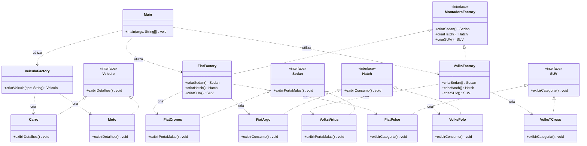

# Factory Method e Abstract Factory

Projeto desenvolvido em Java Swing para implementação dos padrões de projeto **Factory Method** e **Abstract Factory**, incluindo a extensão das famílias de veículos para o novo produto **SUV**.

## Parte 1 — Factory Method

Foi implementado o padrão Factory Method para criação de veículos.

A interface `Veiculo` define o método:

```java
void exibirDetalhes();
```

Os produtos concretos são:

- `Carro`
- `Moto`

A criação dos objetos é realizada pela classe `VeiculoFactory`, através do método:

```java
Veiculo criarVeiculo(String tipo);
```

O cliente utiliza a fábrica para criar os veículos, evitando a criação direta de `Carro` e `Moto`.

## Partes 2 e 3 — Abstract Factory

Foi implementado o padrão Abstract Factory para representar famílias de veículos de diferentes montadoras.

### Produtos abstratos

- `Sedan`
- `Hatch`
- `SUV`

### Família Fiat

- `FiatCronos`
- `FiatArgo`
- `FiatPulse`

### Família Volkswagen

- `VolksVirtus`
- `VolksPolo`
- `VolksTCross`

As fábricas responsáveis pela criação das famílias são:

- `FiatFactory`
- `VolksFactory`

Ambas implementam a interface `MontadoraFactory`.

## Diagrama de Classes



## Estrutura do projeto

```text
demo/
└── src/
    └── main/
        └── java/
            └── com/
                └── example/
                    ├── factorymethod/
                    │   ├── Veiculo.java
                    │   ├── Carro.java
                    │   ├── Moto.java
                    │   └── VeiculoFactory.java
                    │
                    ├── abstractfactory/
                    │   ├── Sedan.java
                    │   ├── Hatch.java
                    │   ├── SUV.java
                    │   ├── MontadoraFactory.java
                    │   ├── FiatCronos.java
                    │   ├── FiatArgo.java
                    │   ├── FiatPulse.java
                    │   ├── VolksVirtus.java
                    │   ├── VolksPolo.java
                    │   ├── VolksTCross.java
                    │   ├── FiatFactory.java
                    │   └── VolksFactory.java
                    │
                    └── Main.java
```

## Tecnologias

- Java
- Java Swing
- IntelliJ IDEA
- Git
- GitHub

## Padrões de Projeto

### Factory Method

Utilizado para encapsular a criação dos objetos `Carro` e `Moto`.

### Abstract Factory

Utilizado para criar famílias relacionadas de veículos das montadoras Fiat e Volkswagen, incluindo Sedan, Hatch e SUV.
